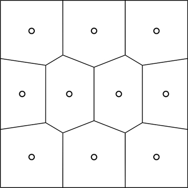
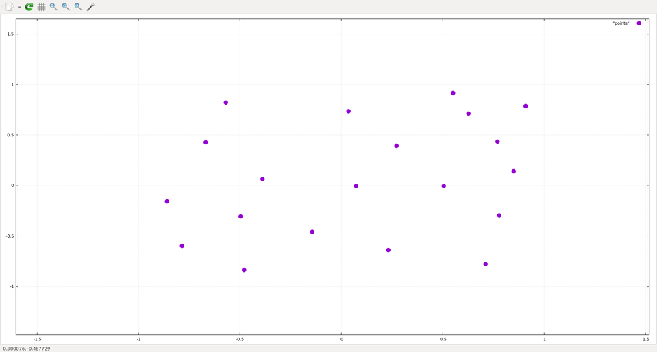
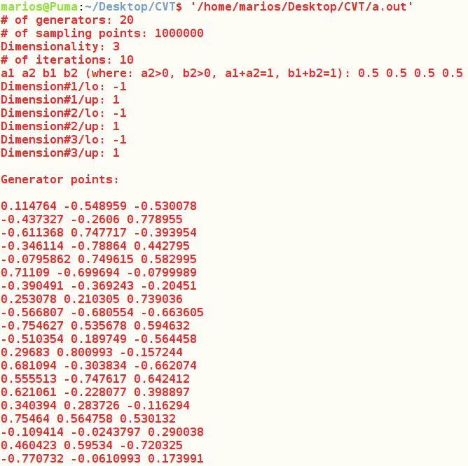
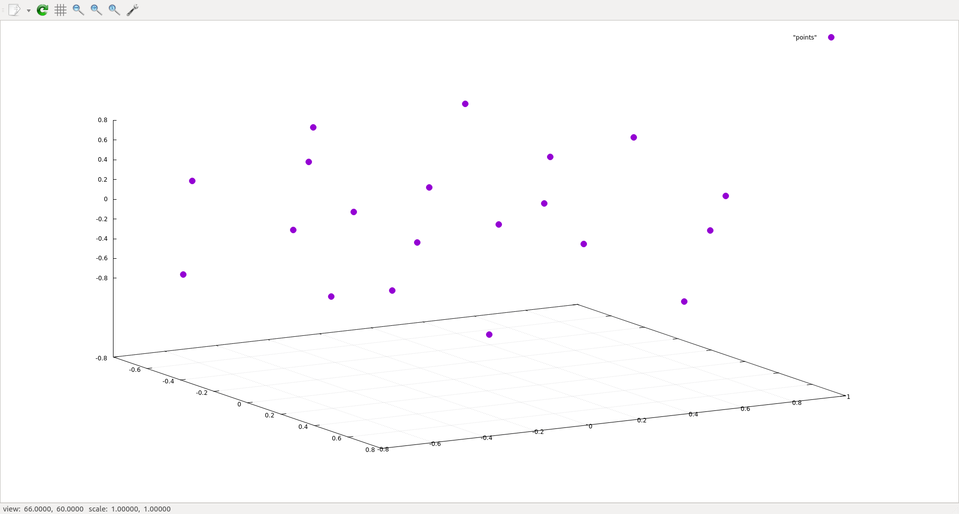

## Description

The PSO performance is greatly affected by the starting positions of the 
particles. A common starting configuration is to randomly initialize each 
particle's position with a uniformly distributed random value. 
However, this configuration does not guarantee that the particles are evenly 
distributed throughout the search-space and is often the cause of variable 
performance. 

A more suitable starting configuration is based on centroidal Voronoi 
tessellations(CVT), and ensures that the particle's initial positions are more
evenly distributed throughout the search-space. 



The Voronoi diagram, shows a 10 point centroidal Voronoi tessellation. The 
circles represent both the generating points of the Voronoi tesselation and the 
centroids of the Voronoi cells. Note that the generator points of the centroidal 
Voronoi tessellation are evenly distributed on the plain.

Ofcourse, the computation of CVT is computationally expensive, but fortunately 
for the problem of swarm initialization we don't need much accuracy - a 
reasonable approximation will do.

## Algorithm

The algorithm computes the generator points for the CVT and was developed by 
Ju, Du, and Gunzburger.


## Execution

**2 Dimensions:**




**3 Dimensions:**





## More info

**Compilation:** 

```g++ main.cpp cvt.cpp -std=c++11```

**2D scatter plot:**

```gnuplot> plot "points.txt" with points pointtype 7```

**3D scatter plot:**

```gnuplot> splot "points.txt" with points pointtype 7```

**Notes:**

The number of sampling points(q) should scale with the number of generators.
	
For q=1, a1=b2=1, and a2=b1=0 this method reduces to MacQueen's probabilistic 
method.

**Reference:**

Lili Ju, Qiang Du, and Max Gunzburger. 2002. Probabilistic methods for 
	centroidal Voronoi tessellations and their parallel implementations. Parallel 
	Comput. 28, 10 (October 2002), 1477-1500. 
	DOI=http://dx.doi.org/10.1016/S0167-8191(02)00151-5